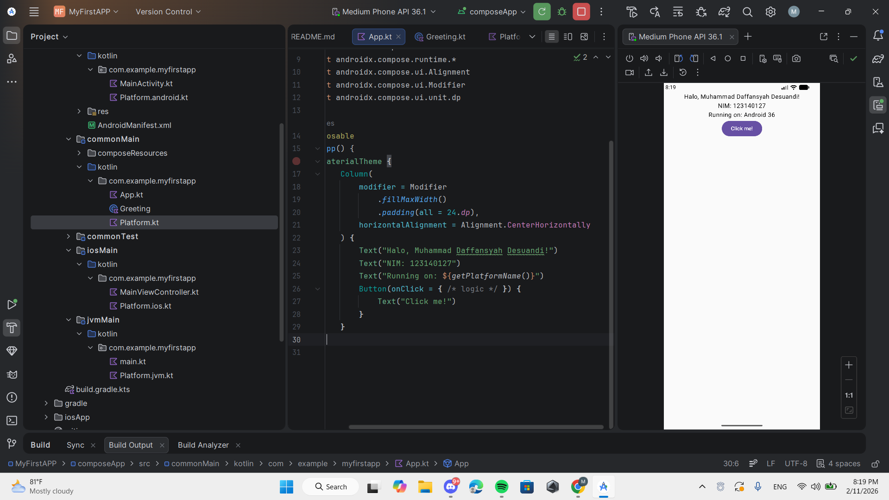

# MyFirstKMPApp

Aplikasi sederhana **Kotlin Multiplatform (KMP)** yang dibuat untuk memenuhi **Tugas Praktikum Minggu 1**.

Proyek ini menunjukkan penggunaan **Kotlin Multiplatform** dengan **Jetpack Compose Multiplatform** untuk membuat aplikasi lintas platform, dengan target utama **Android**.

---

## 👤 Identitas Mahasiswa
- **Nama**: Muhammad Daffansyah Desuandi
- **NIM**: 123140127

---

## 📱 Fitur Aplikasi
- Menampilkan teks sapaan
- Menampilkan nama dan NIM mahasiswa
- Menampilkan informasi platform (Android)

---

## 🛠️ Teknologi yang Digunakan
- Kotlin Multiplatform (KMP)
- Jetpack Compose Multiplatform
- Android Studio
- Gradle (Kotlin DSL)

---

## 📂 Struktur Proyek
composeApp/
├── src/
│ ├── androidMain/ # Kode khusus Android
│ ├── commonMain/ # Kode yang digunakan bersama
│ ├── desktopMain/ # Kode untuk Desktop
│ └── commonTest/ # Unit test

---

## ▶️ Cara Menjalankan Aplikasi (Android)
1. Buka proyek menggunakan **Android Studio**
2. Tunggu hingga proses **Gradle Sync** selesai
3. Pilih **Android Emulator**
4. Klik tombol **Run ▶️**

---

## 📸 Tampilan Aplikasi
*(Tambahkan screenshot aplikasi di sini jika diperlukan)*

---

## 📌 Catatan
Proyek ini dibuat sebagai bagian dari **Praktikum Kotlin Multiplatform – Minggu 1** dan bertujuan untuk memahami dasar penggunaan KMP dan Jetpack Compose Multiplatform.

---

## 📸 Tampilan Aplikasi

